# ClearTravel

An offline-first, Material You Android travel companion. Track train PNRs and flight
status, plan trip itineraries on a map, and pack with reusable checklists — all
**serverless**: your data lives in a local Room database on the device, live status
comes straight from public third-party sources, and the only cloud dependency is an
optional Google account link for Calendar/Drive sync.

## Features

- **Train journeys** — add tickets manually, from a pasted IRCTC SMS/email, from a
  PDF/image via on-device OCR, or from a shared PNR link; the same PNR is never added
  twice. Refresh PNR status through a rule-driven in-app WebView (you solve the
  captcha; the app reads the result automatically). One-tap hands-free route fetch
  (ixigo, erail.in fallback) stored for an offline route page, a **seat map** of your
  coach with the rake's coach positions, ticket cards with status pills, share a
  ticket as an image + PNR link, detail bottom sheets, archive, deep-linkable
  notifications.
- **Flight journeys** — add flights manually (date from a picker), import a boarding
  pass (BCBP barcode / OCR) or a booking confirmation (e-ticket PDF/image); duplicates
  are refused. One-tap "Save & check status" opens the airline's status page in a
  WebView, auto-fills the query, dismisses consent walls, and extracts status / gate /
  terminal / times into the app — and for every airline without a dedicated rule the
  same flow reads **Google's flight-status card** (cancelled / delayed / landed, gates,
  struck-through originals). Clear failure banner with Retry when the page can't be
  read, timestamped last-check outcome on the sheet, background status polling with
  gate/delay notifications, and per-airline web check-in shortcuts.
- **Trip itineraries** — day-grouped timeline of stays, activities and transport
  (auto-sorted by time, drag to override), plus a Google Maps view of the trip (needs
  a Maps key and Play services). Places come from a **place search** (OpenStreetMap
  Nominatim suggestions, platform geocoder fallback), a tap on the map, typed
  coordinates or a **shared Google Maps link** (short links resolved in the
  background). Commute legs link to your train/flight journeys — pick an existing
  one or add a new one right from the leg (you are taken to Journeys and brought back
  with it linked) and take their departure time from the journey; a journey's detail
  sheet lists the trips it is part of, one tap apart.
- **Packing checklists** — per-trip checklists built from editable preset templates
  (append multiple presets, track packed counts).
- **Travel documents** — keep scans of your passport, visas, ID, insurance and
  tickets as encrypted local files with typed labels and optional expiry dates
  (expiring-soon and expired flags), find them with a live search box, and open them
  in the shared **document viewer** (pinch-zoom, rotate, fullscreen, PDF paging,
  share, save a copy; a side rail in landscape). Stored on-device only and included
  in backups.
- **Backup & restore** — versioned local export/import with tombstone-aware merge
  (see `docs/backup-format.md`), plus optional Google Drive backups with a restore
  ladder on fresh installs.
- **Google sync (optional)** — link a Google account (Credential Manager) to sync
  journeys/trips into a dedicated "ClearTravel" calendar and keep Drive backups.
  Fully optional; everything works without it.
- **Material You** — dynamic color with a sensible seed fallback, dark/light/system
  theme, large accessible type, long-press explanations on every icon-only control.
- **Guided first run** — a four-step wizard: create the password (with an optional
  fingerprint toggle), connect a Google account for Drive backups or stay offline,
  restore a backup from a file or from Drive (or start fresh), and — when the backup
  comes from another install — enter *its* password. Every step stays available
  later from Settings.
- **Encrypted at rest, locked by you** — on first run you create a password; it
  protects a random master key that encrypts the database (SQLCipher), every stored
  document/boarding pass/attachment, and every backup — including the copies kept
  in Google Drive, which only ClearTravel can read. Unlock with the password or,
  optionally, biometrics; password fields work with password managers. **There is
  no recovery: forget the password and the data is gone by design.**

## Architecture

Multi-module Gradle project, package root `com.itsluminous.cleartravel`:

| Layer | Modules |
|---|---|
| Shell | `app` (single-activity Compose, bottom navigation, deep links, e2e suite) |
| Design | `core:designsystem` (theme + shared components) |
| Contracts | `core:model` (syncable domain models), `core:database` (Room), `core:data` (repositories, status-provider interfaces, settings, backup, SQLCipher wiring) |
| Security | `core:security` (key vault, file ciphers, portable backup envelope, biometric wrapper, UI lock) |
| Engines | `core:scrape` (rule-driven WebView scraper), `core:ocr` (ML Kit text + BCBP), `core:notifications`, `core:google` (Calendar/Drive sync) |
| Features | `feature:applock`, `feature:trains`, `feature:flights`, `feature:itinerary`, `feature:checklist`, `feature:documents`, `feature:menu` |
| Test infra | `core:testing` |

Key principles (full details in `AGENTS.md` and `docs/decisions.md`):

- **Offline-first** — every screen reads from Room via Flows and renders with no
  network; status fetches write to Room, never block the UI.
- **Behavior-as-data** — scrape rules, check-in windows, checklist presets and OCR
  patterns are versioned JSON/data files, each guarded by a recorded fixture test.
- **Syncable entities** — every entity carries a UUID, `updated_at` and a tombstone,
  enabling conflict-free backup merges and Drive restore.
- **Feature isolation** — feature modules depend only on `core:*`; cross-feature
  interaction goes through `core:data` contracts.
- **Encryption below the data layer** (ADR-031) — a random master key, wrapped by
  the password (PBKDF2-HMAC-SHA256, 210k) and optionally by a biometric Keystore
  key, keys SQLCipher and a chunked AES-GCM file format; backups and Drive uploads
  use a password-derived portable envelope so they restore on any install that
  knows the password. Details: `docs/decisions.md` ADR-031, `docs/backup-format.md`.

## Security notes

- The password is never stored; the master key is stored only wrapped. Losing the
  password loses the data — there is intentionally no reset or recovery path.
- Sharing or "Save a copy" from the viewer, and exporting a backup to a location
  you choose, produce files outside the app's control: shared copies are plaintext
  (that is the point of sharing); exported backups are encrypted with your password.
- Background jobs (flight polling, calendar sync, Drive uploads) need the key, which
  exists only after you unlock the app in the current process; until then they post
  a single "Unlock ClearTravel to sync" reminder and skip.
- Upgrading from a pre-encryption build converts the database and files in place on
  the first unlock; Drive files uploaded before the upgrade remain unencrypted until
  pruned or deleted.

## Building

Requirements: JDK 17, Android SDK (compileSdk 36, minSdk 26).

Optional keys go in `local.properties` (git-ignored; empty values are safe defaults):

```properties
# Google Maps SDK key — needed only for the trip map view
MAPS_API_KEY=...
# OAuth *Web application* client ID — needed only for Google account linking
# (Calendar/Drive sync). See docs/google-setup.md for the full setup walkthrough.
GOOGLE_WEB_CLIENT_ID=...
```

```bash
./gradlew assembleDebug          # app/build/outputs/apk/debug/ClearTravel-debug.apk
./gradlew installDebug           # install on a connected device/emulator
```

## Testing

```bash
./gradlew ktlintCheck            # style (ktlint_official)
./gradlew lintDebug              # Android lint (hardcoded strings are errors)
./gradlew testDebugUnitTest      # unit tests incl. Robolectric DAO + fixture tests
./gradlew connectedDebugAndroidTest   # e2e suite on a running emulator

# full local quality gate (same as CI)
./gradlew ktlintCheck lintDebug testDebugUnitTest assembleDebug
```

On-device validation runs (real airline/railway sites, screenshots) are documented in
`docs/validation-report.md`.

## Release

Tag `main` with `vX.Y.Z` and push the tag — `.github/workflows/release.yml` re-runs
the full quality gate, builds a release APK whose `versionName` derives from the tag,
and attaches it to a GitHub Release.

Signing uses four repository secrets: `KEYSTORE_BASE64`, `KEYSTORE_PASSWORD`,
`KEY_ALIAS`, `KEY_PASSWORD`. When they are absent (e.g. on forks) the workflow falls
back to a clearly named debug-signed `*-debugsigned.apk` so the artifact is still
installable.

## Screenshots

Demo data on a Pixel emulator (`docs/screenshots/`):

| Trips | Trip map | Itinerary timeline | Dark theme |
| :---: | :---: | :---: | :---: |
| 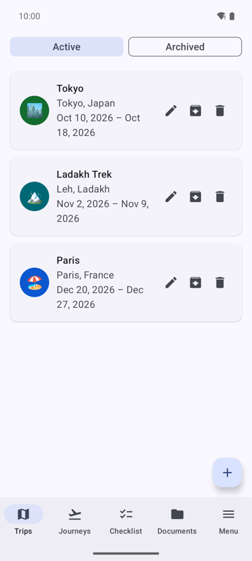 | 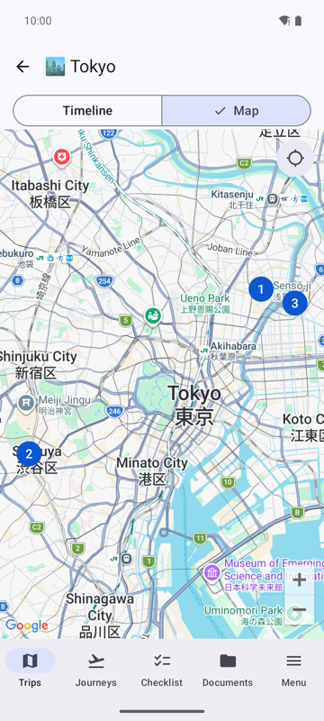 | 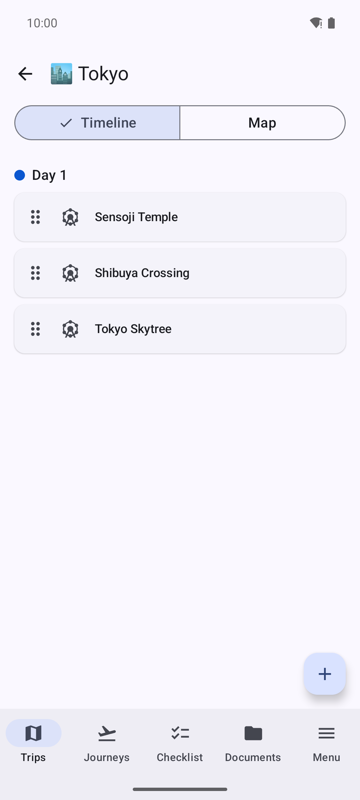 | 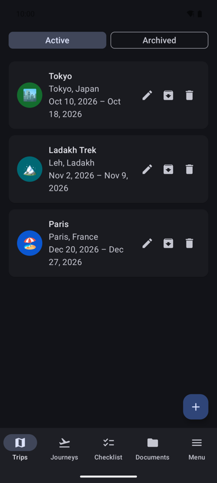 |

| Train tickets | Offline train route | Seat map | Flights |
| :---: | :---: | :---: | :---: |
| 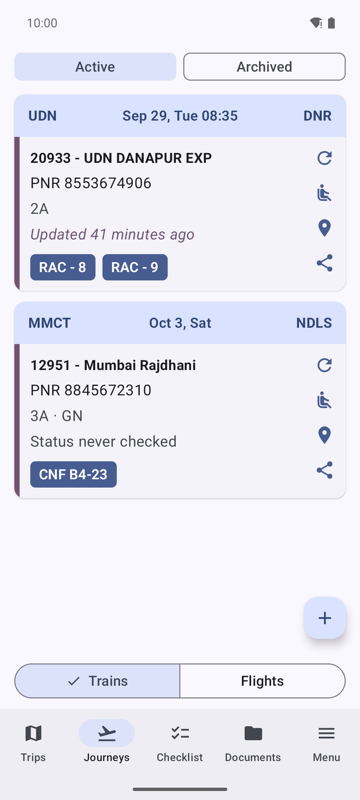 | 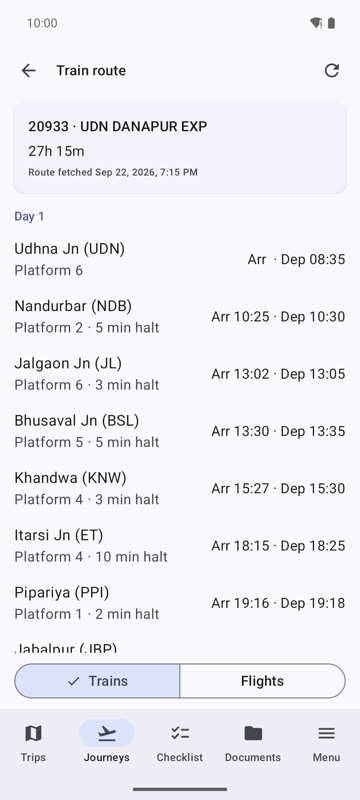 | 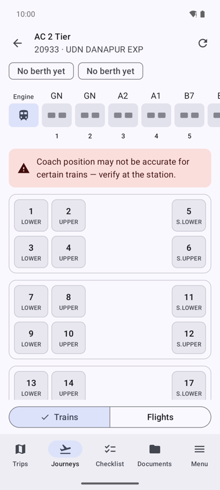 | 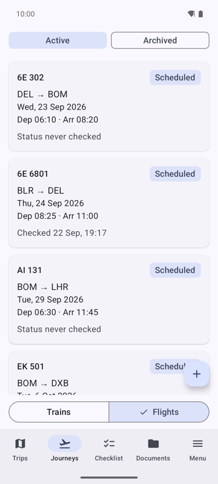 |

| Flight details | Checklists | Packing checklist | Travel documents |
| :---: | :---: | :---: | :---: |
| 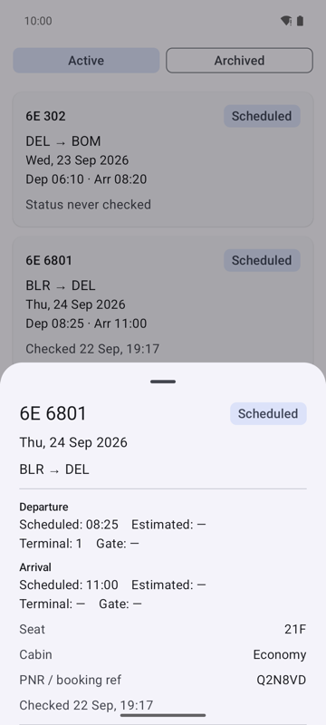 | 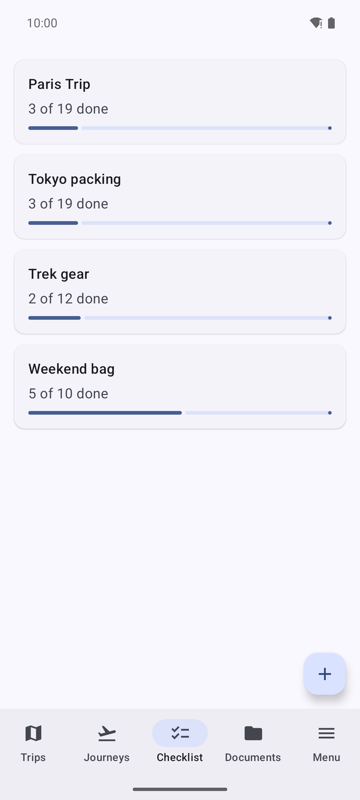 | 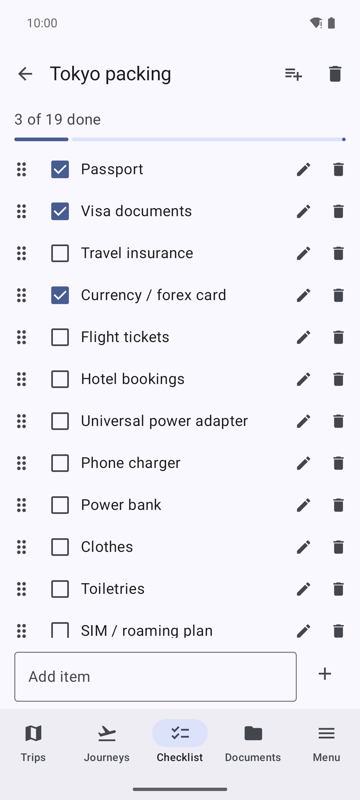 | 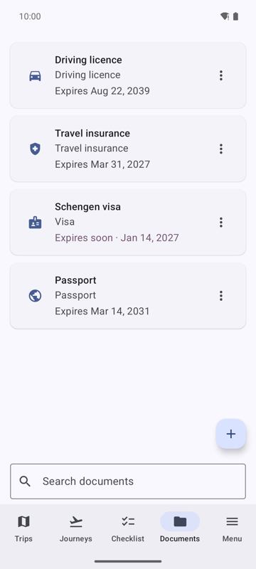 |

On-device validation runs against real railway/airline sites are documented with
their own screenshots in `docs/validation-report.md`.
