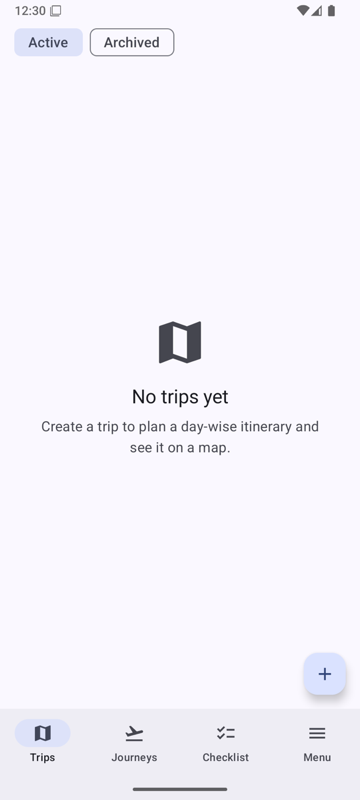
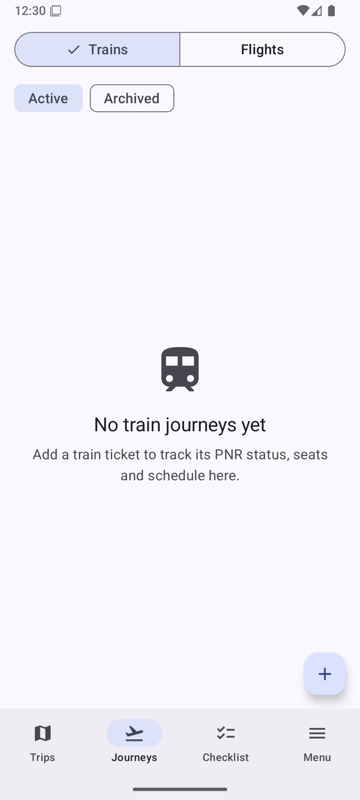
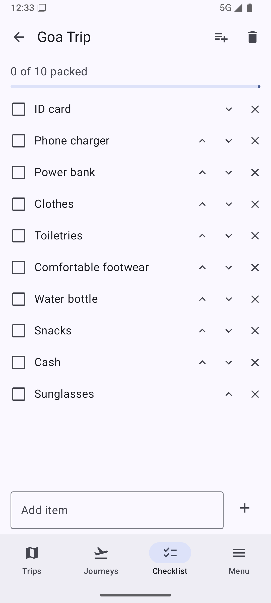
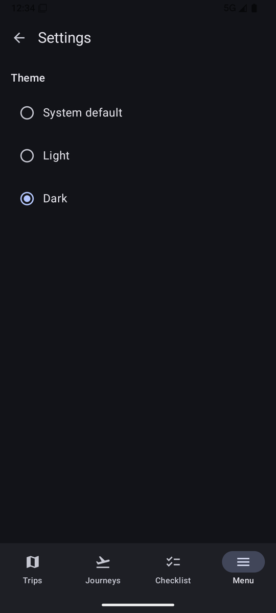
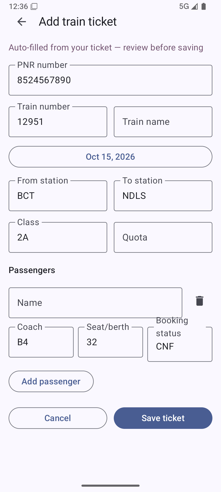
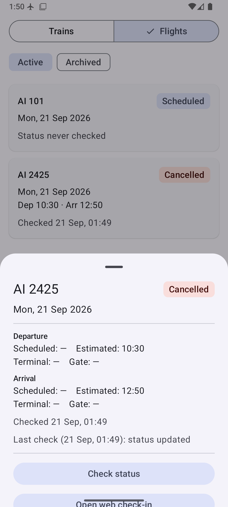
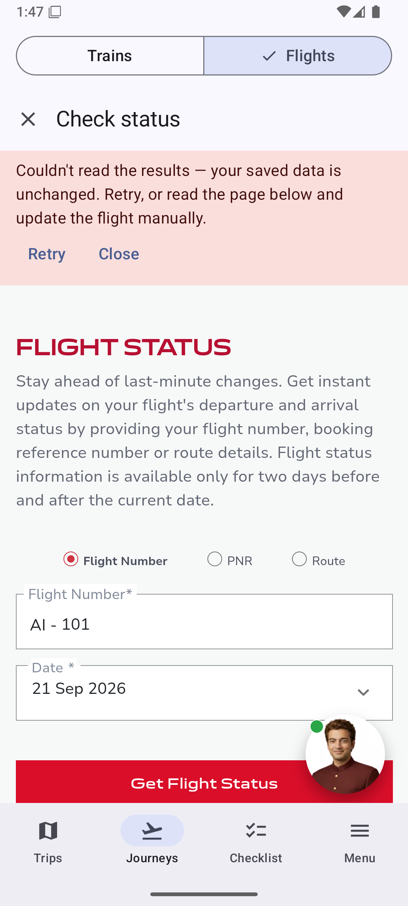
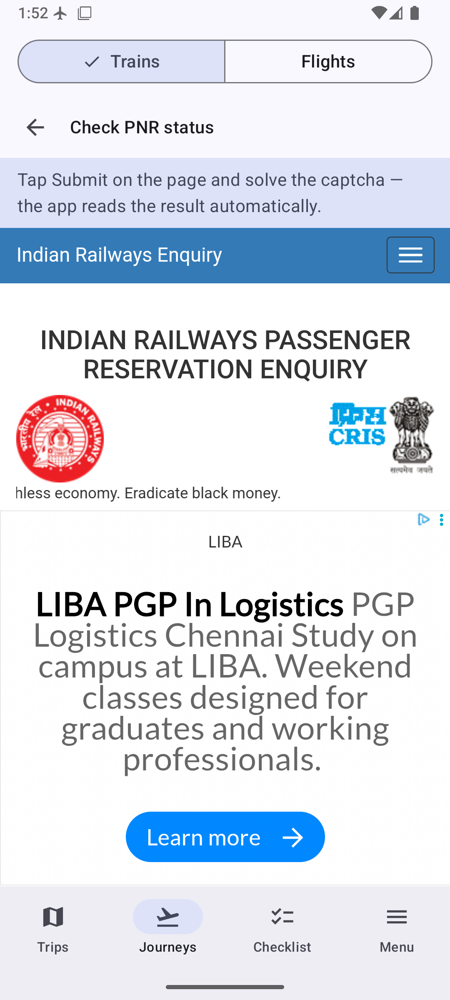

# ClearTravel

An offline-first, Material You Android travel companion. Track train PNRs and flight
status, plan trip itineraries on a map, and pack with reusable checklists — all
**serverless**: your data lives in a local Room database on the device, live status
comes straight from public third-party sources, and the only cloud dependency is an
optional Google account link for Calendar/Drive sync.

## Features

- **Train journeys** — add tickets manually, from a pasted IRCTC SMS/email, or from a
  PDF/image via on-device OCR. Refresh PNR status through a rule-driven in-app
  WebView (you solve the captcha; the app reads the result automatically). Detail
  bottom sheets, archive, deep-linkable notifications.
- **Flight journeys** — add flights manually or import a boarding pass (BCBP barcode
  / OCR). One-tap "Save & check status" opens the airline's status page in a WebView,
  auto-fills the query, dismisses consent walls, and extracts status / gate /
  terminal / times into the app. Clear failure banner with Retry when the page can't
  be read, timestamped last-check outcome on the sheet, background status polling
  with gate/delay notifications, and per-airline web check-in shortcuts.
- **Trip itineraries** — day-grouped timeline of stays, activities and transport,
  plus a Google Maps view of the trip (needs a Maps key and Play services).
- **Packing checklists** — per-trip checklists built from editable preset templates
  (append multiple presets, track packed counts).
- **Backup & restore** — versioned local export/import with tombstone-aware merge
  (see `docs/backup-format.md`), plus optional Google Drive backups with a restore
  ladder on fresh installs.
- **Google sync (optional)** — link a Google account (Credential Manager) to sync
  journeys/trips into a dedicated "ClearTravel" calendar and keep Drive backups.
  Fully optional; everything works without it.
- **Material You** — dynamic color with a sensible seed fallback, dark/light/system
  theme, large accessible type, long-press explanations on every icon-only control.

## Architecture

Multi-module Gradle project, package root `com.itsluminous.cleartravel`:

| Layer | Modules |
|---|---|
| Shell | `app` (single-activity Compose, bottom navigation, deep links, e2e suite) |
| Design | `core:designsystem` (theme + shared components) |
| Contracts | `core:model` (syncable domain models), `core:database` (Room), `core:data` (repositories, status-provider interfaces, settings, backup) |
| Engines | `core:scrape` (rule-driven WebView scraper), `core:ocr` (ML Kit text + BCBP), `core:notifications`, `core:google` (Calendar/Drive sync) |
| Features | `feature:trains`, `feature:flights`, `feature:itinerary`, `feature:checklist`, `feature:menu` |
| Test infra | `core:testing` |

Key principles (full details in `AGENTS.md` and `docs/decisions.md`):

- **Offline-first** — every screen reads from Room via Flows and renders with no
  network; status fetches write to Room, never block the UI.
- **Behavior-as-data** — scrape rules, check-in windows, checklist presets and OCR
  patterns are versioned JSON/data files, each guarded by a recorded fixture test.
- **Syncable entities** — every entity carries a UUID, `updated_at` and a tombstone,
  enabling conflict-free backup merges and Drive restore.
- **Feature isolation** — feature modules depend only on `core:*`; cross-feature
  interaction goes through `core:data` contracts.

## Building

Requirements: JDK 17, Android SDK (compileSdk 36, minSdk 26).

Optional keys go in `local.properties` (git-ignored; empty values are safe defaults):

```properties
# Google Maps SDK key — needed only for the trip map view
MAPS_API_KEY=...
# OAuth *Web application* client ID — needed only for Google account linking
# (Calendar/Drive sync). See docs/google-setup.md for the full setup walkthrough.
GOOGLE_WEB_CLIENT_ID=...
```

```bash
./gradlew assembleDebug          # app/build/outputs/apk/debug/ClearTravel-debug.apk
./gradlew installDebug           # install on a connected device/emulator
```

## Testing

```bash
./gradlew ktlintCheck            # style (ktlint_official)
./gradlew lintDebug              # Android lint (hardcoded strings are errors)
./gradlew testDebugUnitTest      # unit tests incl. Robolectric DAO + fixture tests
./gradlew connectedDebugAndroidTest   # e2e suite on a running emulator

# full local quality gate (same as CI)
./gradlew ktlintCheck lintDebug testDebugUnitTest assembleDebug
```

On-device validation runs (real airline/railway sites, screenshots) are documented in
`docs/validation-report.md`.

## Release

Tag `main` with `vX.Y.Z` and push the tag — `.github/workflows/release.yml` re-runs
the full quality gate, builds a release APK whose `versionName` derives from the tag,
and attaches it to a GitHub Release.

Signing uses four repository secrets: `KEYSTORE_BASE64`, `KEYSTORE_PASSWORD`,
`KEY_ALIAS`, `KEY_PASSWORD`. When they are absent (e.g. on forks) the workflow falls
back to a clearly named debug-signed `*-debugsigned.apk` so the artifact is still
installable.

## Screenshots

From the on-device validation runs (`docs/validation/`):

| | |
|---|---|
| Trips |  |
| Journeys |  |
| Checklist from preset |  |
| Dark theme |  |
| Ticket prefilled from SMS |  |
| Flight status extracted live |  |
| Scrape failure UX (banner + retry) |  |
| PNR check WebView |  |
